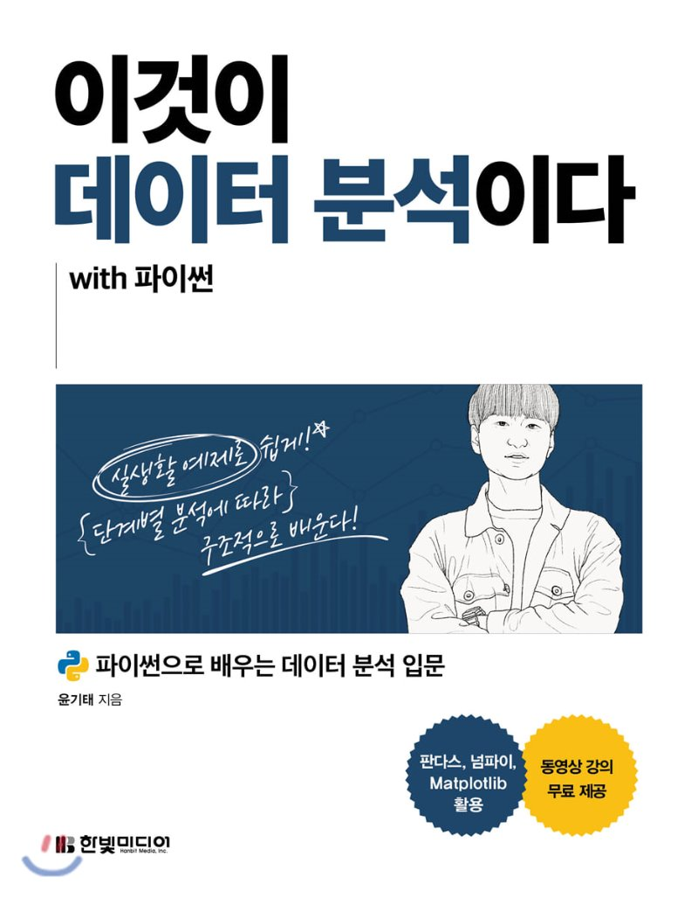

# 이것이 데이터 분석이다

----
## 목표
1. 데이터 분석의 개념을 이해
2. 데이터 분석을 따라가면서 **혼자서 데이터 분석을 할 수 있는 능력** 배양

## 방법
1. 책을 읽으면서 코드 필사
2. 부족하거나 모르는 내용을 보충하고 해당 내용을 깃허브, 블로그에 정리
3. 이후 깃허브와 블로그에 정리한 내용을 개념에 따라 구조화

----
## **책소개**

**실생활 예제로 쉽게, 단계별 분석에 따라 구조적으로 배우는 데이터 분석 입문서**

- 데이터를 다루는 데 언어나 라이브러리는 도구일 뿐입니다. 진짜 중요한 것은 문제해결 능력입니다. 이 책은 주어진 문제를 어떻게 단계적으로 접근하면 좋을지에 대해 독자 친화적으로 가이드를 주는 책입니다. 프로그래밍 기초 지식만 있다면 통계에 대한 지식이 전혀 없는 비전공자도 데이터 분석에 입문할 수 있도록 쉽게 풀어쓴 책입니다.
- [저자 깃허브](https://github.com/yoonkt200/python-data-analysis.git)